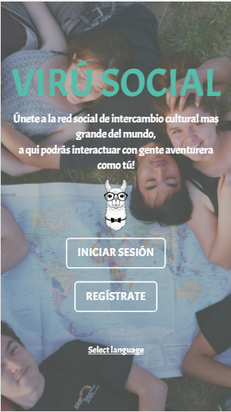
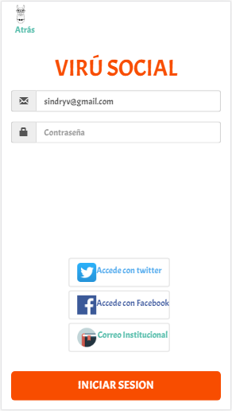
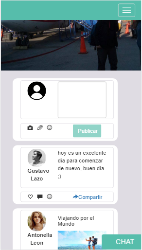
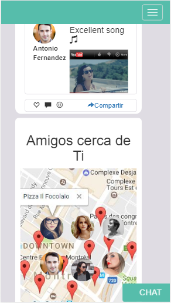

# RETO DE CODIGO RED SOCIAL
Track: Common Core.  
Curso: Crea tu propia red social.

## RESEÑA
En el siguiente trabajo se realizó una web-app responsive con motivos peruanos que acerca a mas personas de diferentes culturas ,la red social tiene de nombre VIRÚ SOCIAL al ingresar a VIRÚ SOCIAL te conectas con la red mas grande de intercambio cultural que mediante un mapa de geolocalizacion te conecta con personas que se encuentren cerca de ti con gustos en común.

## FLUJO DE LA APLICACIÓN
- Vista principal se encuantra la bienvenida de VIRÚ SOCIAL y dos botones ,el primero indica "Registro" en el cual el usuario nuevo tiene que ingresar sus datos,correo y contraseña que se guardara en nuestra base de datos. El segundo boton indica "Iniciar Sesion" en el cual el usuario tiene que ingresar el correo y contraseña que utilizó para registrarse.
- Vista Contenido se muestra un newfest de las publicaciones de los usuarios,a su vez el usuario de VIRÚ SOCIAL tambien puede realizar sus publicaciones. Se encuentra tambien un mapa de geolocalizacion en el cual se muestran los usuarios cerca de ti al hacer click en la imagen de alguno se muestra un modal en el cual aparece sus datos y un boton de seguir.
- Vista Perfil en esta vista se muestra el un espacion en el que puede realizar publicaciones y al mismo tiempo una seccion en la cual pueda publicar sus fotos.
## Herramientas
- CSS3 (@Media Queries)  
- HTML5  
- FRAMEWORK BOOTSTRAP  
- JQUERY  
- JS VANILLA  
- FIREBASE
## INTEGRANTES  
Alejandra Hoces.  
Valeria Valles.

**Organización**  

[Proyecto final Red Social](https://trello.com/b/IRfVnxbQ/producto-final-redes-sociales)

 #### Vistas de la aplicacion

> vistas/inicio

> Vista principal

